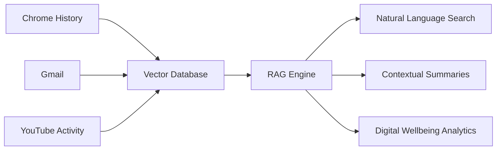

<div align="center">

<!-- Animated Header with Gradient Text -->


</div>

<!-- Typing Animation with Custom Styling -->
<p align="center">
  
</p>

---

<!-- Animated Snake eating contributions -->
<div align="center">
  


</div>

<!-- Social Badges with Hover Effects -->
<div align="center">

[](mailto:mdshehzaadkhan001@gmail.com)
[](https://linkedin.com/in/shehzaad-khan-b25619346)
[](https://github.com/Shehzaad-khan)
[](https://leetcode.com/shehzaad_khan)
[](#)


</div>

---

## 🎯 **The Engineer Behind The Code**

```typescript
const shehzaad: Engineer = {
    identity: {
        role: "Computer Science Student @ PES University",
        location: "Bengaluru, India 🇮🇳",
        cgpa: "8.26/10.0",
        year: "3rd Year (5th Semester)",
        graduation: "2027"
    },
    
    philosophy: [
        "🔍 First principles > frameworks",
        "⚡ Ship fast, iterate faster",
        "🧠 Understand the 'why', not just the 'how'",
        "🎯 Build systems that fail gracefully",
        "📊 Data + Math + Engineering = Magic"
    ],
    
    expertise: {
        systems: ["Distributed Systems", "OS Internals", "Kernel Programming"],
        ml: ["Deep Learning", "Reinforcement Learning", "Time Series Analysis"],
        data: ["Kafka", "Spark", "Hadoop", "Real-time Streaming"],
        web: ["MERN Stack", "FastAPI", "Flask", "Production Auth"]
    },
    
    currentFocus: {
        learning: ["Rust 🦀", "MLOps", "Distributed Consensus"],
        building: ["E.C.H.O - AI Chrome Extension", "RAG Systems"],
        reading: ["DDIA", "Designing ML Systems", "System Design"]
    },
    
    stats: {
        contributions: 399,
        repositories: 24,
        languages: ["Python", "C", "C++", "Java", "JavaScript", "Scala"],
        commits: "94% Code • 3% Reviews • 2% PRs • 1% Issues"
    }
};
```

---

## 🛠️ **Technology Stack**

<div align="center">

### **Core Languages**


### **AI/ML & Data Science**


### **Big Data & Distributed Systems**


### **Web Development**


### **Databases**


### **DevOps & Tools**


</div>

---

## 📊 **GitHub Analytics**

<div align="center">

<!-- GitHub Stats Cards with Custom Theme -->


<!-- Streak Stats -->


<!-- Activity Graph -->


<!-- Trophy Showcase -->


</div>

---

## 🚀 **Featured Engineering Projects**

<!-- Project Cards with Enhanced Styling -->
<table width="100%">
<tr>
<td width="50%" valign="top">

### 🎮 [HangmanMind - Game AI](https://github.com/moaahil1110/Machine-Learning-Hackathon-Hangman)

> **94.40% Win Rate** | Deep RL + Probabilistic Models

**The Problem:** Build an AI that doesn't just guess randomly.

**The Solution:**
- 🎯 Hybrid architecture: HMM + Word Filtering + DQN
- 🧠 Adaptive strategy weighting based on search space
- ⚡ 2.13 avg wrong guesses, 0 repeated guesses

**Tech:** `PyTorch` `NumPy` `Reinforcement Learning`

**Impact:** Pure RL = 7.18%, Hybrid = 94.40%

[](https://github.com/moaahil1110/Machine-Learning-Hackathon-Hangman)

</td>
<td width="50%" valign="top">

### 🌊 [MetricFlow - Real-Time Monitor](https://github.com/Shehzaad-khan/MetricFlow)

> Distributed Streaming | Sub-second Latency

**Architecture:**
```
Producers → Kafka → Spark → Analytics → Alerts
```

**Features:**
- ⚙️ Fault-tolerant with ZooKeeper coordination
- 📊 30s windowed aggregations
- 🚨 Multi-metric correlation alerting
- 🔗 Secure multi-machine deployment

**Tech:** `Kafka` `Spark` `ZeroTier` `Python`

**Scale:** 1000+ events/sec processing

[](https://github.com/Shehzaad-khan/MetricFlow)

</td>
</tr>

<tr>
<td width="50%" valign="top">

### 🗂️ [Mini HDFS - Distributed FS](https://github.com/Shehzaad-khan/Mini-Hdfs-Simulation)

> Built Hadoop Core from Scratch

**What I Built:**
- 🏗️ Namenode-Datanode architecture
- 📦 Automatic 2MB chunking
- 🔄 2x replication with exponential backoff
- 💓 Heartbeat-based failure detection
- 🛡️ Length-prefixed TCP protocol
- 📊 Real-time Flask dashboard

**Tech:** `Python` `TCP Sockets` `Multi-threading`

**Learning:** Distributed consensus, network failures, data durability

[](https://github.com/Shehzaad-khan/Mini-Hdfs-Simulation)

</td>
<td width="50%" valign="top">

### 🐧 [Linux Process Tracker](https://github.com/Shehzaad-khan/Linux-Process-Tracker)

> Kernel Space Meets User Space

**Deep Dive into OS:**
- 🔧 Custom kernel module (init/cleanup)
- 🧵 Multi-process spawning with `fork()`
- 📊 `/proc` filesystem parsing:
  - `/proc/[pid]/maps` for memory regions
  - `/proc/[pid]/smaps` for RSS, dirty pages
- 🔍 Parent-child memory tracking

**Tech:** `C` `Linux Kernel API` `POSIX`

**Signal:** Can debug at kernel level

[](https://github.com/Shehzaad-khan/Linux-Process-Tracker)

</td>
</tr>

<tr>
<td width="50%" valign="top">

### 📈 [MarketPulse - Stock Analytics]()

> Time Series | Statistical Modeling

**Pipeline:**
- 📊 Seasonal decomposition (trend + seasonality)
- 📉 ADF stationarity testing
- 🔮 SARIMA forecasting
- 🎲 Markov chain volatility modeling

**Tech:** `Pandas` `Statsmodels` `Matplotlib`

**Strength:** Statistical rigor + real insights

</td>
<td width="50%" valign="top">

### 🏠 [RentWise - Price Prediction](https://github.com/Shehzaad-khan/Predicting-Airbnb-Rental-Prices)

> ML Pipeline | Feature Engineering

**Workflow:**
1. Feature engineering (reviews, host, location)
2. Model comparison (Linear, RF, SVR, NN)
3. K-Means market segmentation
4. Hyperparameter tuning + CV

**Tech:** `Scikit-learn` `Pandas` `NumPy`

**Outcome:** Pricing strategy insights

[](https://github.com/Shehzaad-khan/Predicting-Airbnb-Rental-Prices)

</td>
</tr>
</table>

---

## 💼 **Professional Experience**

<details open>
<summary><b>🔥 Click to Expand Experience</b></summary>

### **Freelance Full-Stack Developer** @ AutoML Platform
`Nov 2024` | `Remote` | `Production Delivery`

**The Challenge:** Build production-ready authentication in 1 week.

**What I Delivered:**
- 🔐 Complete auth flow: Login, signup, email verification, password reset
- ⚛️ **Frontend:** React with protected routes & auth state
- ⚡ **Backend:** FastAPI with JWT session handling
- 🔥 **Auth:** Firebase Authentication integration
- 🗄️ **Database:** MongoDB for persistent user data
- ✅ **Outcome:** On-time delivery, client-approved

**Tech Stack:**


</details>

---

## 🎓 **Education & Achievements**

<table width="100%">
<tr>
<td width="50%">

### 🎓 **PES University, Bengaluru**
**B.Tech in Computer Science**  
📅 2023 – 2027 | 🎯 CGPA: **8.26/10**

**Core Coursework:**
- Data Structures & Algorithms
- Operating Systems & Computer Networks
- Distributed Systems & Cloud Computing
- Machine Learning & Generative AI
- Database Management Systems

</td>
<td width="50%">

### 🏆 **Academic Excellence**

**Pre-University (PUC):**  
🏫 St. Francis PU Composite College  
📊 Percentage: **95.16%**

**High School (ICSE):**  
🏫 St. Mira's High School  
📊 Percentage: **95.6%**

### 📈 **GitHub Contributions**
- **399** contributions in last year
- **24+** public repositories
- **94%** commits, 3% reviews, 2% PRs

</td>
</tr>
</table>

---

## 🔬 **Current Work - Capstone Project**

<div align="center">

### **🎯 E.C.H.O — Efficient Contextualized History Orchestrator**

> *Making your digital history actually useful*

</div>

**The Problem:**  
Your browser history, Gmail, and YouTube are disconnected silos. Finding "that article from 2 weeks ago" is impossible.

**The Solution:**  
AI-powered Chrome extension with unified search across all your digital activity.

**Architecture:**


**Key Features:**
- 🔍 **Natural Language Search** across all sources
- 🧠 **RAG-based Retrieval** with semantic understanding
- 🔒 **Privacy-First** (local storage + vector DB)
- 📊 **Digital Wellbeing** analytics & insights

**Tech Stack:**


---

## 🎯 **Current Learning Focus**

<div align="center">

```yaml
2026_roadmap:
  systems_programming:
    - language: "Rust 🦀"
      focus: "Memory safety without GC"
    - concepts: ["Distributed Consensus", "Paxos", "Raft"]
  
  ml_engineering:
    - mlops: ["Model Deployment", "A/B Testing", "Feature Stores"]
    - agentic_ai: ["Multi-agent Systems", "Tool Use", "Planning"]
    - llm_ops: ["RAG Optimization", "Fine-tuning", "Prompt Engineering"]
  
  reading_list:
    - "Designing Data-Intensive Applications" # 60% done
    - "Designing Machine Learning Systems"    # In progress
    - "System Design Interview Vol 1 & 2"     # Up next
  
  competitive_coding:
    - platform: "LeetCode"
    - solved: "40+ problems (Easy → Hard)"
    - focus: ["Binary Search", "DP", "Graphs", "Trees"]
```

</div>

---

## 🎨 **More About Me**

<div align="center">

### 🧠 **Engineering Philosophy**

</div>

```python
class EngineeringPrinciples:
    def __init__(self):
        self.mindset = [
            "💡 Think in systems, not just code",
            "⚖️ Every decision is a trade-off",
            "🔍 Question assumptions before building",
            "🚀 Ship fast, but ship correctly",
            "📚 Read code > write code (for learning)"
        ]
    
    def debug_approach(self, bug):
        """How I tackle hard problems"""
        steps = [
            "1. Reproduce consistently",
            "2. Isolate the subsystem",
            "3. Reason about state transitions",
            "4. Form hypothesis, test hypothesis",
            "5. Fix root cause, not symptom"
        ]
        return steps
    
    def learn_new_tech(self, technology):
        """My learning methodology"""
        return {
            "step_1": "Read official docs, not Medium posts",
            "step_2": "Build toy project to understand constraints",
            "step_3": "Read source code of production systems",
            "step_4": "Teach concept to validate understanding"
        }
```

---

## 🌟 **What I'm Looking For**

I'm actively seeking:

- 🎯 **Internship Opportunities** in ML Engineering, Backend Systems, or Data Engineering
- 🤝 **Open Source Contributions** to real-world distributed systems or ML infrastructure
- 🧪 **Research Collaborations** in MLOps, Agentic AI, or System Performance
- 💡 **Interesting Problems** that sit at the intersection of Systems + ML

**What I bring:**
- Strong fundamentals in algorithms, systems, and ML theory
- Production experience building scalable systems
- Ability to dive deep into unfamiliar codebases
- Hunger to solve hard, ambiguous problems

---

## 📫 **Let's Connect & Build**

<div align="center">

### 💬 *"The best systems are built by people who care about correctness, not just features."*

<br/>

I'm always excited to discuss:
- 🏗️ **Distributed Systems Architecture** & trade-offs
- 🤖 **ML System Design** & production challenges  
- 🔧 **Performance Engineering** & optimization
- 📚 **Technical Deep Dives** on complex systems
- 💡 **Open Source** collaboration opportunities

<br/>

<!-- Contact Buttons -->
<a href="mailto:mdshehzaadkhan001@gmail.com">
  
</a>
<a href="https://linkedin.com/in/shehzaad-khan-b25619346">
  
</a>
<a href="https://github.com/Shehzaad-khan">
  
</a>
<a href="https://leetcode.com/shehzaad_khan">
  
</a>

<br/><br/>

**⚡ Response Time:** Usually within 24 hours  
**☕ Coffee Chat:** Always open to interesting conversations  
**🌍 Timezone:** IST (UTC +5:30)

</div>

---

<div align="center">

<!-- Random Dev Quote -->


<br/><br/>

<!-- Footer Wave Animation -->


</div>

<!-- Hidden Easter Egg for Profile Visitors -->
<!--
🎉 Congratulations! You've reached the end!
If you're reading this, you're the kind of person who reads documentation thoroughly.
We'd probably work well together. Let's connect!
-->